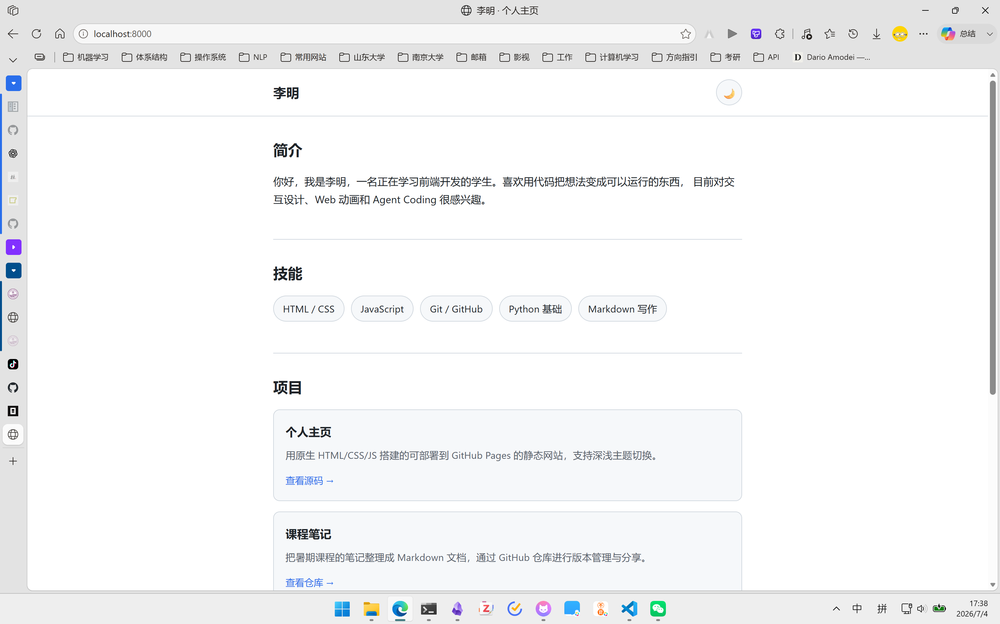
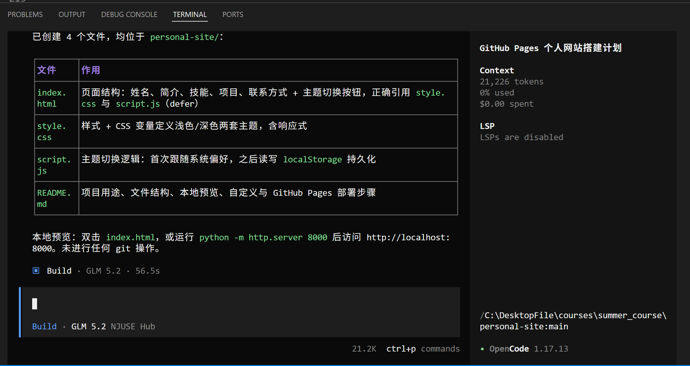
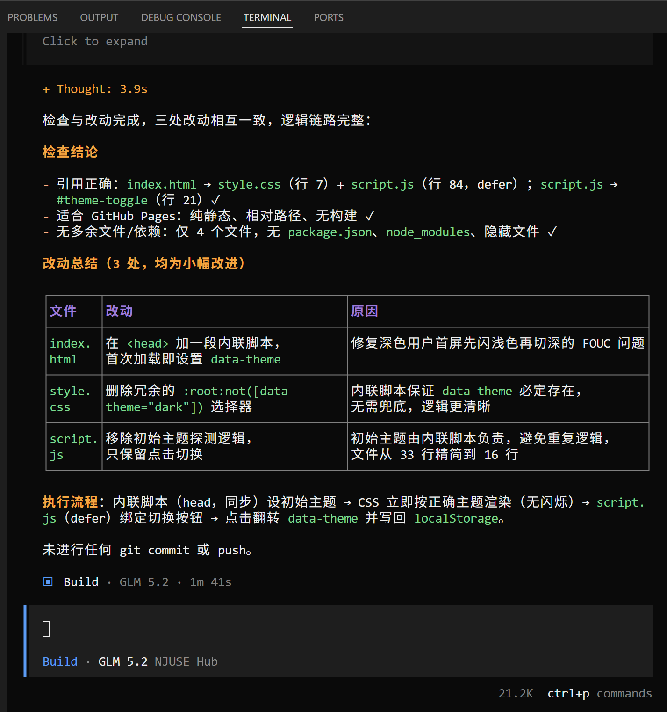
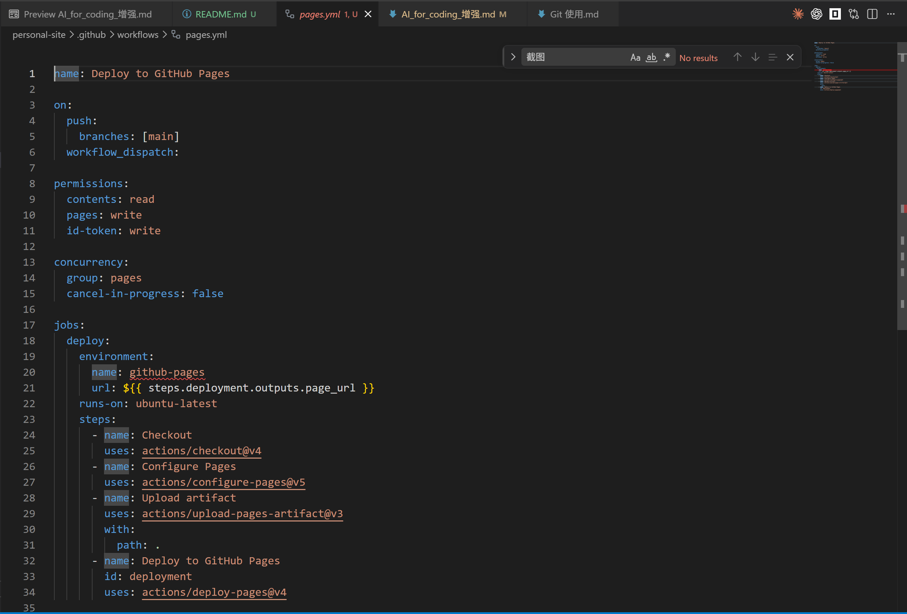
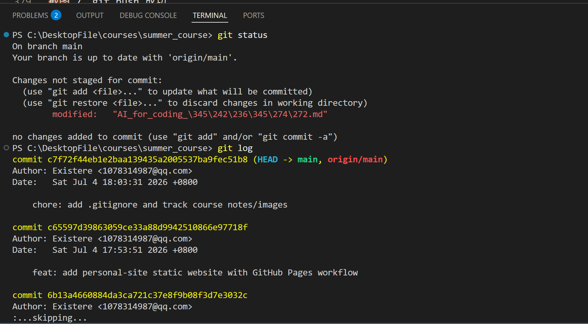
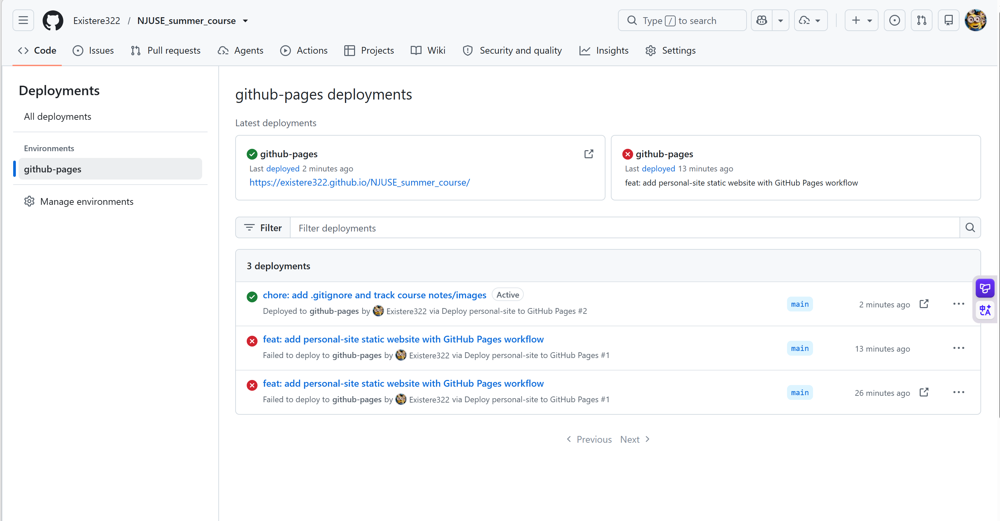
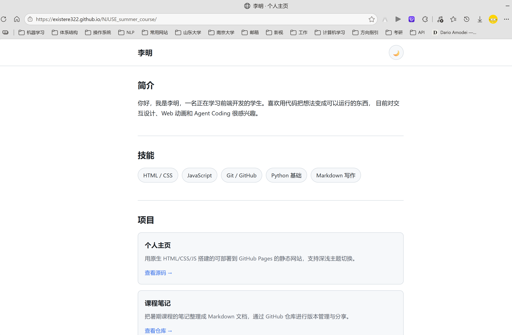

# AI for Coding 增强：用 OpenCode 搭建并部署一个个人网站

## 最小 Demo 流程

## 一、本节目标

这一节我们不只是讲“怎么让 AI 写代码”，而是用一个完整小 Demo 说明：

> Coding Agent 可以进入项目目录，读写文件、运行命令、检查结果，并协助我们把一个最小个人网站部署到 GitHub Pages。

本节结束时，我们希望完成一个最小成果：

```text
一个可以访问的 GitHub Pages 个人网站
```

学生需要理解四件事：

1. AI for Coding 已经从“代码补全”发展到“Agent 做工程任务”；
2. Coding Agent 的核心不是生成代码，而是读项目、改文件、跑命令、做验证；
3. Prompt 不需要玄学化，只要说清楚目标、上下文、约束和验收标准；
4. Git、diff、commit、push、GitHub Pages 是 Agent Coding 落地的最小闭环。


# 0. Demo 最终产物

这节课我们要让 OpenCode 帮我们完成：

```text
personal-site/
├── index.html
├── style.css
├── script.js
├── README.md
└── .github/
    └── workflows/
        └── pages.yml
```

网站内容不复杂，只需要包含：

* 个人姓名；
* 简短介绍；
* 技能标签；
* 项目展示；
* 联系方式；
* 一个简单交互，例如点击按钮切换主题或显示一句话。

部署目标：

```text
https://<GitHub用户名>.github.io/<仓库名>/
```

GitHub Pages 可以从仓库分支或 GitHub Actions 发布站点；使用 GitHub Actions 部署静态文件时，官方文档要求上传 Pages artifact，并由 Pages 部署流程发布。


# 1. 开场：AI for Coding 的三个阶段

以前我们说 AI 写代码，很多人想到的是代码补全。

第一阶段是：

```text
代码补全：我写一半，AI 补下一段。
```

第二阶段是：

```text
对话式改代码：我问 ChatGPT，它给我一段代码。
```

第三阶段才是今天要讲的：

```text
Coding Agent：我给一个任务，Agent 读项目、改文件、跑命令、验证结果。
```

OpenCode 属于这种 Coding Agent。它可以在终端、IDE 或桌面环境中帮助开发者写代码；OpenCode 文档也支持通过 Skills 发现和加载可复用的 Agent 指令。

所以今天我们不是让 AI 回答“个人网站怎么写”，而是让 Agent 真的在本地创建项目、写代码、配置部署、执行 Git 操作。

过渡语：

> 接下来我们边讲边做：我会把一个模糊需求变成结构化 Prompt，然后让 OpenCode 一步步搭建并部署网站。


# 2. Coding Agent 的基本工作模式

Coding Agent 的工作流可以压缩成六步：

```text
理解任务 → 探索项目 → 制定计划 → 修改代码 → 运行验证 → 汇报结果
```

这和普通 ChatGPT 的区别在于：

```text
普通 ChatGPT：主要回答你。
Coding Agent：可以进入项目并操作文件。
```

但 Agent 不能完全放飞。我们要给它明确边界。

这节课的最小 Prompt 结构是：

```text
目标：
上下文：
约束：
验收标准：
```

这四项足够支撑大多数 Agent Coding 任务。


# 3. Demo Step 1：创建项目并让 Agent 先规划

先在终端准备目录：

```bash
mkdir personal-site
cd personal-site
opencode
```

然后输入第一个 Prompt。

## Prompt 1：让 Agent 规划，不要立刻写代码

```text
请帮我搭建一个可以部署到 GitHub Pages 的最小个人网站。

目标：
- 创建一个静态个人网站；
- 页面包含姓名、简介、技能、项目展示、联系方式；
- 有一个简单交互，例如切换深色/浅色主题；
- 最终可以通过 GitHub Pages 访问。

上下文：
- 这是暑期课程的 Agent Coding 最小 Demo；
- 项目尽量简单，使用原生 HTML、CSS、JavaScript；
- 不使用前端框架，不引入构建工具。

约束：
- 先给出文件结构和实现计划；
- 暂时不要创建或修改文件；
- 不要安装任何依赖。

验收标准：
- 计划清楚；
- 文件数量尽量少；
- 后续可以直接部署到 GitHub Pages。
```

讲解重点：

> 这里体现的是 Agent Coding 的第一个原则：不要一上来就让 Agent 写代码，而是先让它理解任务并给出计划。

此处截图：

```text
截图 1：OpenCode 给出的项目结构和实现计划
```


# 4. Demo Step 2：让 Agent 创建网站文件

确认计划合理后，输入第二个 Prompt。

## Prompt 2：按计划实现网站

```text
请按照刚才的计划创建最小个人网站。

要求：
1. 创建 index.html、style.css、script.js、README.md；
2. 页面风格简洁，适合课程展示；
3. index.html 正确引用 style.css 和 script.js；
4. script.js 实现一个主题切换按钮；
5. README.md 写清楚项目用途和本地预览方式；
6. 完成后总结创建了哪些文件；
7. 不要进行 git commit，不要 push。
```

Agent 完成后，人工检查：

```bash
ls
```

如果有 Python，可以本地预览：

```bash
python -m http.server 8000
```

浏览器打开：

```text
http://localhost:8000
```

讲解重点：

> 这一步体现 Agent 的第二个核心能力：它不只是生成一段代码，而是能按项目结构创建多个文件。

此处截图：

```text
截图 2：项目文件结构
```



```text
截图 3：浏览器本地预览页面
```



# 5. Demo Step 3：让 Agent 检查和改进页面

此时不要直接部署，先让 Agent 做一次自检。

## Prompt 3：让 Agent 自查

```text
请检查当前个人网站项目。

要求：
1. 检查 index.html、style.css、script.js 是否互相引用正确；
2. 检查页面是否适合部署到 GitHub Pages；
3. 检查是否存在无用文件或不必要依赖；
4. 如果需要小幅改进，可以修改；
5. 修改后总结改动；
6. 不要 git commit，不要 push。
```

然后人工检查 diff：

```bash
git status
git diff
```

如果还没有初始化 Git，则先执行：

```bash
git init
git branch -M main
```

讲解重点：

> Agent 说“完成了”不等于真的完成。我们必须用运行结果、文件结构和 git diff 来验证。

此处截图：

```text
截图 4：OpenCode 修改总结
```




# 6. Demo Step 4：配置 GitHub Pages 部署

这里有两种部署方式：

1. GitHub Pages 直接从分支根目录部署；
2. GitHub Actions 自动部署。

为了体现工程化流程，这里建议使用 GitHub Actions。

先让 Agent 创建 workflow。

## Prompt 4：创建 GitHub Pages Actions 工作流

```text
请为这个静态网站添加 GitHub Pages 部署配置。

要求：
1. 创建 .github/workflows/pages.yml；
2. 使用 GitHub Actions 将当前目录作为静态网站发布到 GitHub Pages；
3. 不需要构建步骤，因为这是原生 HTML/CSS/JS 项目；
4. workflow 支持 push 到 main 时自动部署；
5. workflow 支持手动触发 workflow_dispatch；
6. 完成后解释这个 workflow 每一步做什么；
7. 不要 git commit，不要 push。
```

讲解重点：

> 这里从 Agent Coding 过渡到 CI/CD：我们不是手动上传文件，而是把部署流程写成配置文件，让 GitHub 自动执行。

GitHub Pages 官方文档给出的 Actions 部署思路就是：push 到默认分支或手动触发 workflow，checkout 仓库，如果需要则构建静态文件，然后用 upload-pages-artifact 上传静态文件供 Pages 部署。

此处截图：

```text
截图 5：Agent 生成的 .github/workflows/pages.yml
```




# 7. Demo Step 5：Git 检查、提交、push

现在进入 Git + Agent 安全工作流。

如果远程仓库还没有创建，先在 GitHub 创建一个空仓库，例如：

```text
personal-site-demo
```

不要勾选 README，保持空仓库。

然后在本地添加 remote：

```bash
git remote add origin https://github.com/<用户名>/<仓库名>.git
```

如果已经有 origin，检查：

```bash
git remote -v
```

然后让 Agent 使用 Git Safe Push Skill。

## Prompt 5：一键检查并 push

```text
Use the git-safe-push skill.

请一键检查并 push 当前项目。

要求：
1. 检查当前目录是否是 Git 仓库；
2. 检查 remote origin；
3. 检查当前分支；
4. 检查 git status 和 git diff；
5. 检查是否有敏感文件；
6. 如果安全，帮我 add、commit、push；
7. commit message 使用：feat: add personal site demo；
8. 不要 force push；
9. 如果当前分支是 main，请提醒我这是主分支，但这是个人教学仓库第一次 push，可以继续。
```

如果没有使用 Skill，也可以人工执行：

```bash
git status
git diff
git add .
git commit -m "feat: add personal site demo"
git push -u origin main
```

讲解重点：

> Git 是 Agent Coding 的安全带。Agent 可以改代码，但我们必须通过 status、diff、commit 和 push 把修改变成可审查、可回滚、可同步的工程记录。

此处截图：

```text
截图 6：git status & git log
```



# 8. Demo Step 6：打开 GitHub Pages 查看结果

push 成功后，打开 GitHub 仓库。

检查：

```text
Actions → pages workflow 是否运行成功
Settings → Pages → Source 是否为 GitHub Actions
```

如果 Pages 还没有启用，需要到：

```text
Settings → Pages → Build and deployment → Source → GitHub Actions
```

等待部署完成后，打开 Pages 地址：

```text
https://<用户名>.github.io/<仓库名>/
```

此处截图：

```text
截图 8：GitHub Actions 部署成功
截图 9：GitHub Pages 网站访问成功
```





结尾总结：

> 这里，我们完成了一个完整 Agent Coding 闭环：提出需求、结构化 Prompt、Agent 创建项目、人工检查、本地预览、生成部署配置、Git 提交、push、GitHub Pages 发布。
> 这就是从“AI 帮我写一段代码”到“Agent 帮我完成一个工程任务”的区别。


# 9. 课堂主线总结

今天最重要的不是个人网站本身，而是这条工作流：

```text
目标描述
  ↓
结构化 Prompt
  ↓
Agent 制定计划
  ↓
Agent 创建文件
  ↓
人工预览和检查 diff
  ↓
Agent 配置部署
  ↓
Git commit / push
  ↓
GitHub Actions
  ↓
GitHub Pages 网站上线
```

需要记住三句话：

```text
1. Prompt 负责把需求说清楚。
2. Skill 负责把重复流程封装起来。
3. Git 和测试负责让 Agent 的修改可检查、可回滚、可部署。
```


# 10. 辅助知识：不放进主线，最后快速介绍

以下内容不必在 Demo 中展开，只需要让学生知道有这些增强路径。

## 10.1 CLI / 桌面 / IDE 模式

CLI 适合展示真实工程过程，桌面模式适合低门槛使用，IDE 模式适合日常开发和查看 diff。

## 10.2 AGENTS.md / CLAUDE.md

项目规则不要每次口头重复，可以写进 `AGENTS.md` 或 `CLAUDE.md`，让 Agent 每次进入项目时都知道运行命令、代码规范和提交规则。

## 10.3 Skill

Skill 是把重复流程写成可复用操作规程，例如：

```text
git-safe-push
debug-with-tests
code-review
rag-read-docs
```

OpenCode 官方 Skills 文档说明，它可以从仓库或用户目录发现 `SKILL.md`，并让 agent 按需加载可复用指令。

## 10.4 Plan / Build 分工

OpenCode 有适合规划分析的 Plan agent；文档说明 Plan agent 默认对文件编辑和 Bash 命令更谨慎，适合在真正修改项目之前做分析和计划。

## 10.5 权限控制与 Hooks

权限控制决定 Agent 能做什么；Hooks 则可以在特定时机自动执行检查。Claude Code 的 Hooks 文档将 Hooks 定义为在生命周期特定点自动执行的 shell 命令、HTTP endpoint 或 LLM prompt，可用于自动化重复检查。

## 10.6 MCP

MCP 可以理解为让 Agent 连接外部工具和数据源的标准接口。初学阶段只需要知道概念，不建议展开配置。


